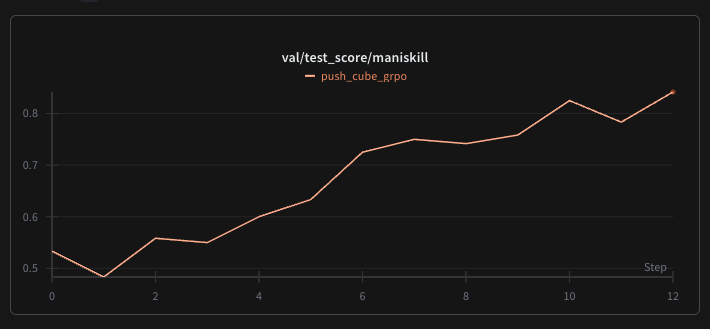
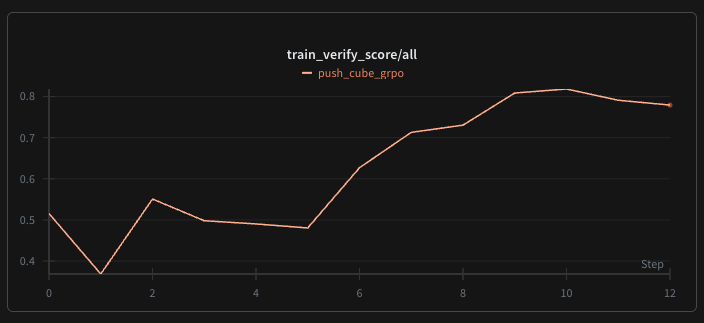

1. To reproduce the experiments
    - Prepare the SFT dataset for swift, a simple example is provided as the ```push_cube``` directory. 

        The script for Maniskill dataset generation is at ```/mnt/nfs3/caozhe/workspace/InternVLA/ManiSkill/generate_dataset.py```. 
        
        Check the class ```InternVLPretrainDatasetGenerator``` for dataset generation details. You may need to generate the raw dataset file with ```mani_skill.trajectory.replay_trajectory``` first.
        
        The sft script is at ```/mnt/nfs3/caozhe/workspace/vlav-project/train_scripts/train_vla_2b_159.sh```.

    - Run ```bash examples/push_cube.sh```. The experiment is conducted on 4 * A100 for 8h.
        
        
2. Key Changes
    - Due to unknown FSDP bugs while forwarding, the model is trained with DDP rather than FSDP.
    - For explaination of the args, check the annotations in ```verl/trainer/config/mani_ppo_trainer.yaml```.

    - Customization of InternVL modeling files

        Change those files under path ```verl/utils/vla_utils/internvl/custom_internvl``` at your will.

    - Environment worker for grpo rollout

        Check the environment worker file at ```verl/workers/rollout/env_workers/maniskill_env_worker.py```. The behavior of your new env worker class shoule be aligned with the exsting one.

    - Rollout scripts for InternVL

        Check the file at ```verl/workers/rollout/rob_rollout.py```. Modify the ```obs_process``` function in ```verl/utils/env_utils/utils.py``` to align the queries and action strings with those in your pretrain dataset.

        Change the prefix control function for generation while rollout, if necessary. Check the ```_build_model_optimizer``` fucntion in file ```verl/workers/ddp_workers.py``` and the ```prepare_logits_processor``` function in ```verl/utils/vla_utils/internvl/utils.py```.

    - Policy update

        The computation of log_probs is modified to align with the actural probability of actions generated under the prefix control function. Check the function ```logits2_logprobs_entropy``` in ```verl/utils/vla_utils/internvl/utils.py``` for details. Be careful that both ```logits2_logprobs_entropy``` and ```prepare_logits_processor``` should be consistent.

    


